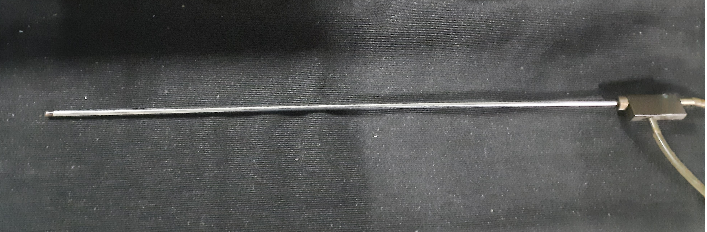
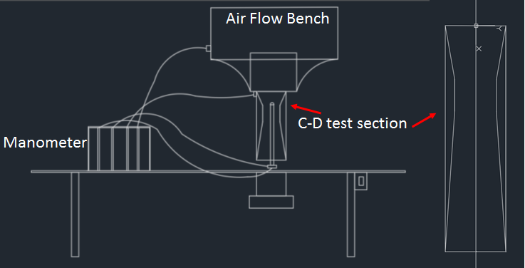

# Procedure

## Required Apparatus

### Airflow bench

  

  

An air flow bench is a small-scale wind tunnel. It is a vertical flow, blow down type, low-speed subsonic wind tunnel with a provision to adjust air flow. The air flow bench parts are as mentioned: blower, flow duct, flow-control valve, honeycomb section, settling chamber, contraction cone, and test section. The blower sucks air from the atmosphere and supplies it to the settling chamber through the flow duct and honeycomb section. Flow-control valve can be used to adjust air flow to vary inlet velocity in the test section. Honeycomb reduces the turbulence coming from the blower. The contraction cone increases the velocity by reducing area at the expense of pressure. There are two pressure tapings in the air flow bench; one at the settling chamber, which gives stagnation or total pressure, and the second at the end of the contraction cone, which gives static pressure. The difference in these two pressure is used to calculate the inlet velocity of the test section.

  

### Convergent-divergent duct

  

### Dimensions of C-D duct

<table class="table border border-3 table-responsive-md table-hover table-bordered ">
<thead>
<tr>
<th style="text-align:center">Sr. no</th>
<th style="text-align:center">Name</th>
<th style="text-align:center">Size (mm)</th>
</tr>
</thead>
<tbody>
<tr>
<td style="text-align:center">1</td>
<td style="text-align:left"><strong>Inlet width</strong></td>
<td style="text-align:center">78</td>
</tr>
<tr>
<td style="text-align:center">2</td>
<td style="text-align:left"><strong>Throat width</strong></td>
<td style="text-align:center">44</td>
</tr>
<tr>
<td style="text-align:center">3</td>
<td style="text-align:left"><strong>Exit width</strong></td>
<td style="text-align:center">78</td>
</tr>
<tr>
<td style="text-align:center">4</td>
<td style="text-align:left"><strong>Duct depth</strong></td>
<td style="text-align:center">50.8</td>
</tr>
<tr>
<td style="text-align:center">5</td>
<td style="text-align:left"><strong>Duct length</strong></td>
<td style="text-align:center">300</td>
</tr>
<tr>
<td style="text-align:center">6</td>
<td style="text-align:left"><strong>Converging section length</strong></td>
<td style="text-align:center">70</td>
</tr>
<tr>
<td style="text-align:center">7</td>
<td style="text-align:left"><strong>Throat length</strong></td>
<td style="text-align:center">42</td>
</tr>
</tbody>
</table>

As the name suggests, this test section consists of varying area sections along the flow direction, first a convergent section, then a constant cross-section, i.e., throat, and then the divergent section. This test section is used to verify Bernoulli's theorem; as the area will change along the flow direction, the flow velocity is expected to change. This experiment tabulates those values and compares them with theoretical values to verify the applicability of the theorem.

  
### Multi-tube manometer

  

  

A multi-tube manometer is a manometer that is capable of acquiring multiple numbers of pressure values at once. During the experiment, we require to acquire four pressure values, two from the air flow bench and two from the pitot static tube. The multi-tube manometer used in this setup is an inclined type, which allows us to increase the resolution of measurement if required.

  

### Pitot-static tube

  

  

A pitot-static tube is a probe that, when kept in flow, measures the flow's total pressure and static pressure at any particular location. In this experiment, we traverse the pitot-static tube from the top of the convergent, divergent test section to the bottom and record the total pressure and static pressure at all different locations.

  
  

## Experimental procedure

  

Schematc of the setup:

  

#### Steps

1. Take dimensions of convergent-divergent duct.

2. Fix the convergent-divergent duct in the air flow bench.

3. Fix the Pitot - static tube along the center of the duct.

4. Set the flow regulator to desired position.

5. Take the pressure measurements from top of the duct to bottom of the duct, by traversing the Pitot - static tube.

    #### Calculations

    - From eq. (3) find the velocity ratio, may call it as theoretical value

    - From eq. (7), find the velocity ratio, may call it as experimental value

    - From eq. (6), find the absolute velocity (VX)

    - Find the free stream velocity of the flow for the statement no. 4 in procedure section, using eq. (4).

6. Plot graph for Bernoulli's equation verification : theoretical (VX/VT) and Experimental (VX/VT) against the streamwise location.