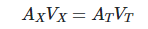
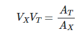
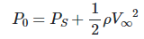
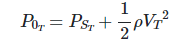
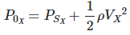
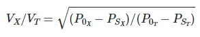

# Theory:

In modern everyday life there are many observations that can be successfully explained by application of Bernoulli's principle, even though no real fluid is entirely in-viscid, e.g. to calculate the lift force on an airfoil, to determine the airspeed of the aircraft using the pitot tube etc. are some most famous examples.

## Formal Statement:
Bernoulli's Principle is essentially a work energy conservation principle which states that for an ideal fluid with no work being performed on the fluid, total energy remains constant. An increase in the speed of the fluid occurs simultaneously with a decrease in pressure or a decrease in the fluid potential energy. Bernoulli's Principle is named in honor of Daniel Bernoulli. 

## Mathematical Description:

From incompressible continuity equation,

 &nbsp; &nbsp; &nbsp; &nbsp; &nbsp; &nbsp; &nbsp; &nbsp; &nbsp; &nbsp; (1)

 &nbsp; &nbsp; &nbsp; &nbsp; &nbsp; &nbsp; &nbsp; &nbsp; &nbsp; &nbsp; (2)

 &nbsp; &nbsp; &nbsp; &nbsp; &nbsp; &nbsp; &nbsp; &nbsp; &nbsp; &nbsp; (3)

From Bernoulli's equation,

 &nbsp; &nbsp; &nbsp; &nbsp; &nbsp; &nbsp; &nbsp; &nbsp; &nbsp; &nbsp; (4)

 &nbsp; &nbsp; &nbsp; &nbsp; &nbsp; &nbsp; &nbsp; &nbsp; &nbsp; &nbsp; (5)

 &nbsp; &nbsp; &nbsp; &nbsp; &nbsp; &nbsp; &nbsp; &nbsp; &nbsp; &nbsp; (6)

From eq. (5) and eq. (6),

 &nbsp; &nbsp; &nbsp; &nbsp; &nbsp; &nbsp; &nbsp; &nbsp; &nbsp; &nbsp; (7)

Where,

A - Duct area

V - Velocity of fluid

P0 - Total pressure

PS - Static pressure

&#x3C1; -  Density of fluid

Subscript

X - Particular location in duct

T - Throat of duct

&#x221E;  -  Freestream 

